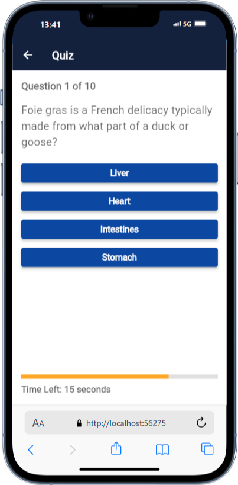

# Flutter Portfolio Project


Welcome to my Flutter Portfolio Project! This repository is a showcase of my journey in mobile app development using Flutter. Dive into the code, explore the features, and see what I've built.

## Table of Contents

- [Features](#features)
- [Screenshots](#screenshots)
- [Getting Started](#getting-started)
- [Installation](#installation)
- [Usage](#usage)
- [Contributing](#contributing)
- [License](#license)

## Features

- **Sleek UI**: A modern, visually appealing user interface.
- **Cross-Platform**: Runs seamlessly on both Android and iOS devices.
- **Interactive Components**: Engaging elements like buttons, sliders, and animations.
- **State Management**: Efficiently managed using the Provider package.
- **API Integration**: Dynamic data fetching from remote APIs.
- **Smooth Navigation**: Easy and intuitive screen transitions.

## Screenshots

### Home Screen
  

 

### Portfolio


### Profile


### Education


### Professional address


### Skill


## Getting Started

To get a local copy up and running, follow these steps.

### Prerequisites

Make sure you have the following installed:

- [Flutter SDK](https://flutter.dev/docs/get-started/install)
- [Android Studio](https://developer.android.com/studio) or [Xcode](https://developer.apple.com/xcode/)

### Installation

1. **Clone the repository**

   ```sh
   git clone https://github.com/maherBoughdiri/flutter-portfolio-app.git
   ```
2. **Navigate to the project directory**

    ```sh
    cd your-flutter-portfolio
    ```
3. **Install dependencies**

    ```sh
    flutter pub get
    ```
## Usage
4. **Run the app**

    ```sh
    flutter run
    ```
5. **Build the app for production**

* For Android:

    ```sh
    flutter build apk
    ```
* For iOS:

    ```sh
    flutter build ios
    ```

## Contributing

Contributions make the open source community a fantastic place to learn and create. Your contributions are greatly appreciated.

## Fork the Project
Create your Feature Branch (git checkout -b feature/AmazingFeature)
Commit your Changes (git commit -m 'Add some AmazingFeature')
Push to the Branch (git push origin feature/AmazingFeature)
Open a Pull Request
## License
Distributed under the MIT License. See LICENSE for more information.

